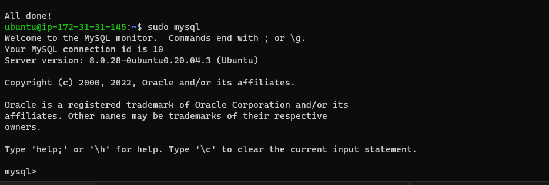
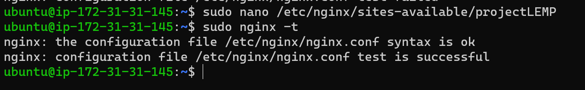

## Project 2 LEMP STACK IMPLEMETATION
 First updating apt `sudo apt update`

instaling nginx `sudo apt install nginx`

 successful, was not able to save image because I saved the image name by creating space between words.

`sudo systemctl status nginx`

`curl http://127.0.0.1:80` or `curl http://localhost:80` 

change port to 80 on AWS(security tab) when instance is running, before running this commads.

[Nginx connected to internect] http://18.234.232.26/ Nginx server can respond to requests from the Internet. http://<Public-IP-Address>:80 pasted my public IP address where it listed like this..http://18.234.232.26:80

Another way to retrieve your Public IP address, other than checking in AWS Web console curl -s http://169.254.169.254/latest/meta-data/public-ipv4

## Step 2 — Installing MySQL

`sudo apt install mysql-server`

`sudo mysql_secure_installation` 

required to create a password or decline. The password setting requires 8 characters with special character, upper/lower case, and numbers.

Password validation, I created my password, and chose YES throught the questions. This is my  verification below.

`sudo mysql` 

To exist use this commad `mysql> exit` was not able to exit, opened a new window.

## Step 3 – Installing PHP

`sudo apt install php-fpm php-mysql`

Installed both package at onces, types yes to continue installation

## Step 4- Configuring Nginx to Use PHP Processor

`sudo mkdir /var/www/projectLEMP`
`sudo chown -R $USER:$USER /var/www/projectLEMP`

`sudo nano /etc/nginx/sites-available/projectLEMP`

This will create a new blank file. Paste in the following bare-bones configuration:

`#/etc/nginx/sites-available/projectLEMP

server {

    listen 80;
    server_name projectLEMP www.projectLEMP;
    root /var/www/projectLEMP;

    index index.html index.htm index.php;

    location / {
        try_files $uri $uri/ =404;
    }

    location ~ \.php$ {
        include snippets/fastcgi-php.conf;
        fastcgi_pass unix:/var/run/php/php7.4-fpm.sock;
     }

    location ~ /\.ht {
        deny all;
    }

}`

To exit type ctrl +x then y, and enter to confirm

`sudo ln -s /etc/nginx/sites-available/projectLEMP /etc/nginx/sites-enabled/`

`sudo nginx -t`

`sudo unlink /etc/nginx/sites-enabled/default`

`sudo systemctl reload nginx`

`sudo echo 'Hello LEMP from hostname' $(curl -s http://169.254.169.254/latest/meta-data/public-hostname) 'with public IP' $(curl -s http://169.254.169.254/latest/meta-data/public-ipv4) > /var/www/projectLEMP/index.html`

http://<Public-IP-Address>:80   Add public key between semicolon  http://18.234.232.26/

The echo  command showing means the Nginx site is working as it should.

## Step 5 – Testing PHP with Nginx

`sudo nano /var/www/projectLEMP/info.php`
 
 Run this command below in the blank space after running the command above.

 `<?php
phpinfo();` 

To exit use ctrl x to save and enter to exit.

 

`http://`server_domain_or_IP`/info.php` to http://`18.234.232.26`/info.php

`sudo rm /var/www/your_domain/info.php`

Error message because domain is not changed, will run command again. It was corrected by typing cd /var/wwww/, then ls and type enter.

`sudo rm /var/www/your_domain/info.php`

## STEP 6 – RETRIEVING DATA FROM MYSQL DATABASE WITH PHP (CONTINUED)

A. `sudo mysql`    
B. `CREATE DATABASE `example_database`;`
\
C. `CREATE USER 'example_user'@'%' IDENTIFIED WITH mysql_native_password BY 'password';`

Had a very diffcult time trying to create the passowrd, so many error message. Deleted and started all over, not sure what the problem was, but fixed it by deleting everything.

`mysql> exit`    ctrl d

`-u example_user -p`

prompted me to creat password, password created.

`SHOW DATABASES;`

`CREATE TABLE example_database.todo_list (item_id INT AUTO_INCREMENT,
content VARCHAR(255), PRIMARY KEY(item_id));`

Had an error message because I included mysql and did not add both bracket. code command was not listed as above, so had to copy command into a different page and remove mysql, and also add the extra bracket. this was the command listed to paste.                     `CREATE TABLE example_database.todo_list (
mysql>     item_id INT AUTO_INCREMENT,
mysql>     content VARCHAR(255),
mysql>     PRIMARY KEY(item_id)
mysql> );`

`INSERT INTO example_database.todo_list (content) VALUES ("My first important item");`

`SELECT * FROM example_database.todo_list;`

To confirm that the data was successfully saved to your table, run code command listed above.

`mysql> exit` ctrl d

`nano /var/www/projectLEMP/todo_list.php` paste this first

`<?php
$user = "example_user";
$password = "password";
$database = "example_database";
$table = "todo_list";

try {
  $db = new PDO("mysql:host=localhost;dbname=$database", $user, $password);
  echo "<h2>TODO</h2><ol>";
  foreach($db->query("SELECT content FROM $table") as $row) {
    echo "<li>" . $row['content'] . "</li>";
  }
  echo "</ol>";
} catch (PDOException $e) {
    print "Error!: " . $e->getMessage() . " ";
    die();
}`

coped this commad above into the blank space, ctrl x, then yes to save, press enter to exit

`http://<Public_domain_or_IP>/todo_list.php`

Got permission denied because I did not include password.

http://18.234.232.26/todo_list.php

Result after password was included in reference to above screenshoot. That means PHP environment is ready to connect and interact with MySQL server.

